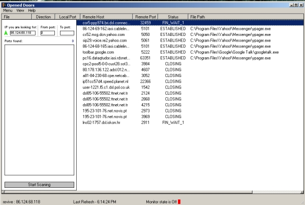



## Opened Doors

### Description

A little firewall application. It can scan an ip for opened ports,

or block ports!
 
### More Info
 
It's seems (but not on all system) that my code have a incompatibility with Zo** Ala** Firewall. Seem that it is not working properly when the firewall is running!

             |
---                |---
**Submitted On**   |2006-05-22 18:09:20
**By**             |[SOSCO](https://github.com/Planet-Source-Code/PSCIndex/blob/master/ByAuthor/sosco.md)
**Level**          |Advanced
**User Rating**    |4.8 (24 globes from 5 users)
**Compatibility**  |VB 6\.0
**Category**       |[Complete Applications](https://github.com/Planet-Source-Code/PSCIndex/blob/master/ByCategory/complete-applications__1-27.md)
**World**          |[Visual Basic](https://github.com/Planet-Source-Code/PSCIndex/blob/master/ByWorld/visual-basic.md)
**Archive File**   |[Opened\_Doo1997155272006\.zip](https://github.com/Planet-Source-Code/sosco-opened-doors__1-65482/archive/master.zip)

